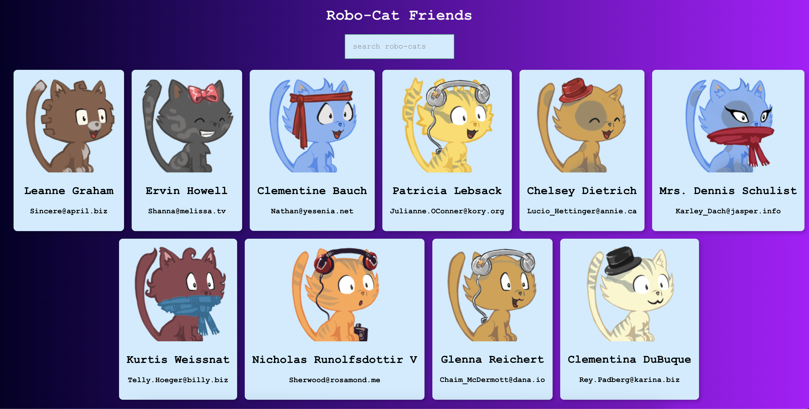

# Section 16: Learn React

The Robofriends project from section 16 of the course with a cat spin.

## Changes from course

Some changes I made from the course include:

- I did not make a scroll component, as simple css covers that without making a whole new component for it.
- Error boundaries can not be converted to functional components, so I left that out. If you take the course and want to keep the class based error boundary, feel free. If you don't want to use the class, there a [package](https://github.com/bvaughn/react-error-boundary) that is suggested to use to make it easier.
- I use `useCallback` and `useMemo` in the landing page file to help with performance.
- Overall styling and file architecture.

## How to Run

- Download zip or clone repo
- CD into the robofriends folder
- Run `npm i` to install all the dependencies
- Run `npm start` to run the application
